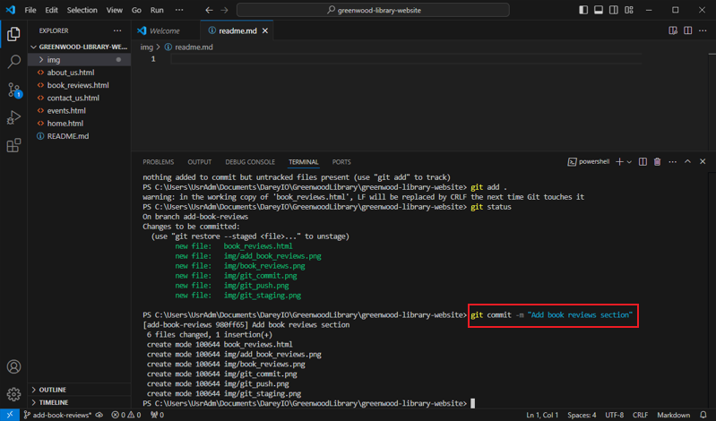
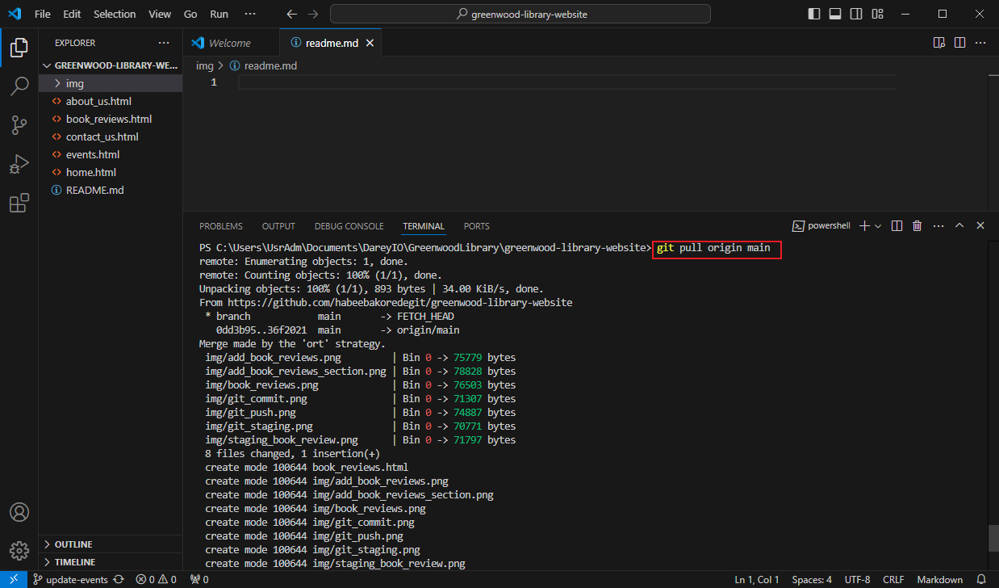

# 02 Capstone Project - Enhancing a Community Library Website
This is my second Capstone project on the DevOps Self-paced Foundation course.

As part of the development team tasked with enhancing the `Greenwood Community Website`, I have added a `Book Reviews` page and also updated the `Events` page.

## Creating and Cloning a Repository on Github
This was done by creating a repository on my remote github account and cloning it on my local machine into the `GreenwoodLibrary` directory.

## Ensuring the following HTML files exist
Using the `vim` command, the following html files were created and contents written inside as shown in the image below.

home.HTML

about_us.HTML

events.HTML

contact_us.HTML

## Staging
Before staging, I ran a `git status` command to show new updates.

The new updates are shown in red.

Then I did the `git add .` command to stage all.

Then I did `git status` again to confirm the updates have been staged.

The staged updates are shown in green.

## Commit
I ran the `git commit` command with the message `"commit task"`.

## Push
I ran the `git push` command.

## Adding Book Reviews Branch
First, I created a branch named `add-book-reviews`

Then I created an html file with `vim` named "book_reviews.html"

I staged all the recent updates with the `git add .` command.

I commited the changes with the message "Add book reviews section"

Then I pushed the branch changes to github

## Raising a Pull Request
I navigated to "add-book-reviews" branch under the main branch.

I initiated and confirmed the pull request as sequentially shown below.

## Merging the work to main branch
After confirming the branch has no conflicts with the base branch, I merged it with the main branch as shown below.

The image below shows that merge was successful.

## Update Events Branch

I swicthed to a new branch named `update-events` branch with the `git checkout -b update-events` as shown below.

I pulled from the main branch for the latest changes with the `git pull origin main` command

Then I initiated a pull request as shown below.

I added a description that `the events page was updated`

I confirmed it.

